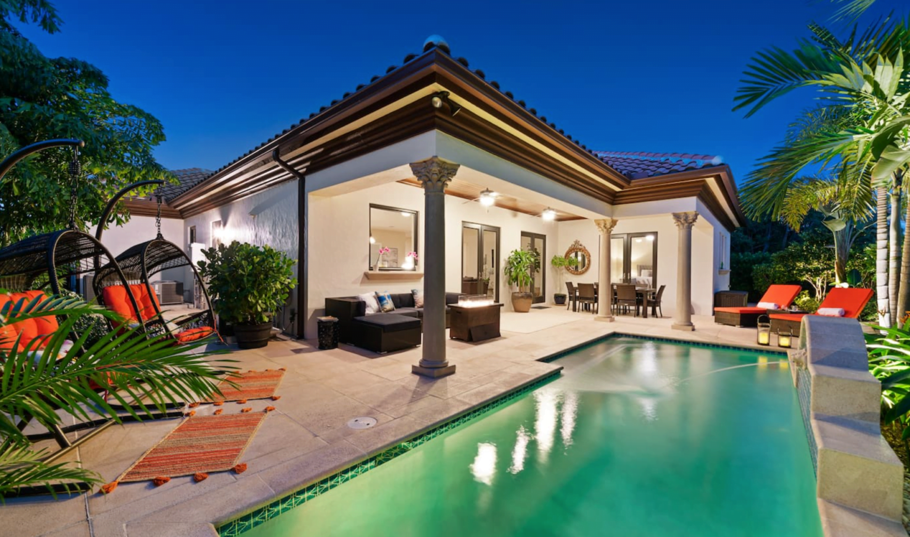
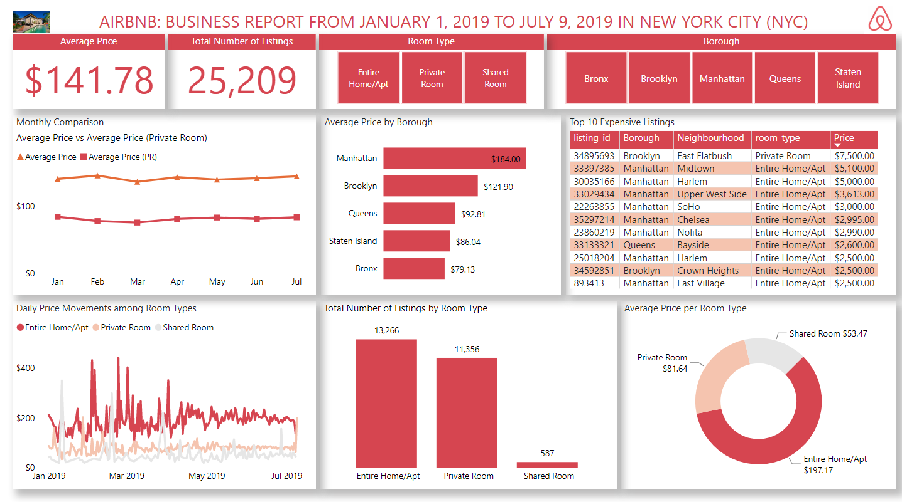

# Airbnb-New-York-City-Market
Analysis of Airbnb's Listings in New York City from January 1, 2019 to July 9, 2019

## ABOUT THE DATASET
Airbnb, Inc. is an American San Francisco-based company operating an online marketplace for short-term homestays and experiences. The company acts as a broker and charges a commission from each booking. This project is about Airbnb’s New York City Market.
Welcome to New York City (NYC), one of the most-visited cities in the world. As a result, there are many Airbnb listings to meet the high demand for temporary lodging for anywhere between a few nights to many months.

The dataset which consists of two .csv files and one .xlsx file can be found here [New York City Airbnb Market | Kaggle.](https://www.kaggle.com/datasets/ebrahimelgazar/new-york-city-airbnb-market)

## PROJECT QUESTIONS
-	What is the average price, per night, of an Airbnb listing in NYC?
-	How does the average price of an Airbnb listing, per month, compare to the private rental market?
-	How many adverts are for private rooms?
-	How do Airbnb listing prices compare across the five NYC boroughs?

## DATA CLEANING
From the Airbnb_price dataset:
-	Used Power Query’s extract text before delimiter function to extract only the numerical values from the price column.
-	Used Power Query’s split column by delimiter function to split “nbhood_full” into Borough and Neighbourhood columns.

From the Airbnb_room_type dataset:
-	Capitalized each word in the room type column for consistency.
-	Fixed the #Name? errors in the description column by removing the equal to sign that preceeded the texts

## LINKS 
- [Documentation | Word file](Documentation.docx)
- [Power BI | Interactive Report](https://app.powerbi.com/view?r=eyJrIjoiNzFjYWQxMDctZjViZC00ZjkzLWE0OWYtYzMxMzhmZThmYzY1IiwidCI6ImE5NjMwYTViLTA5M2EtNDM5Yy04NjM5LThhYmJmMzRhN2M5NyJ9)

## ANSWERS TO PROJECT QUESTIONS
-	The average price of Airbnb listing in NYC is $141.78
-	Private rooms have 11,356 adverts.
- The most expensive listing is a private room in Brooklyn, East Flatbush which costs $7,500.
-	Monthly comparison between Average price for All Listings vs Private Room:

- Price comparison across the five NYC boroughs:

## ANALYSIS REPORT
The interactive version of the report below can be found here [Prince's Analysis | Power BI](https://app.powerbi.com/view?r=eyJrIjoiNzFjYWQxMDctZjViZC00ZjkzLWE0OWYtYzMxMzhmZThmYzY1IiwidCI6ImE5NjMwYTViLTA5M2EtNDM5Yy04NjM5LThhYmJmMzRhN2M5NyJ9)

Thanks for reading :handshake:

